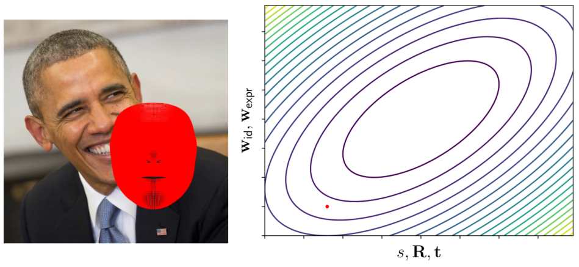
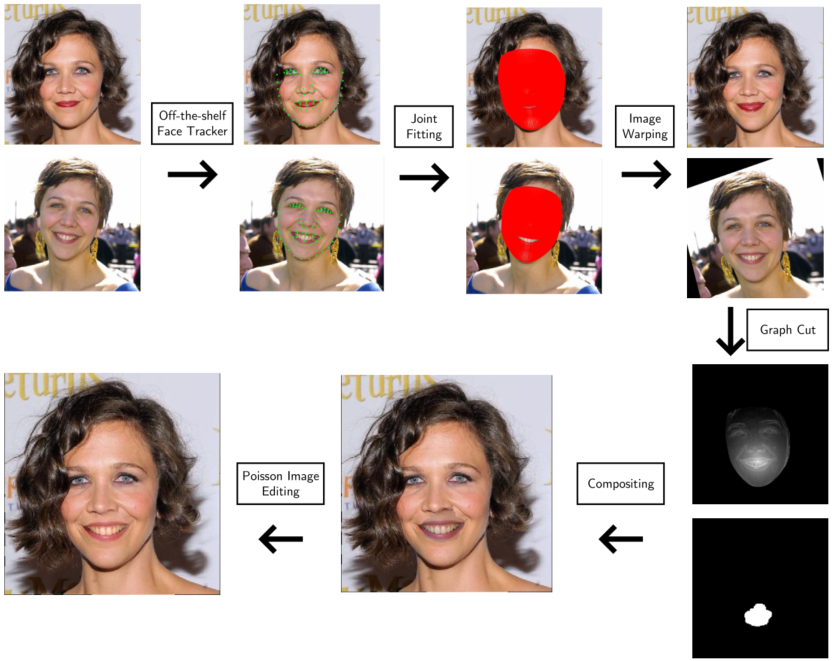
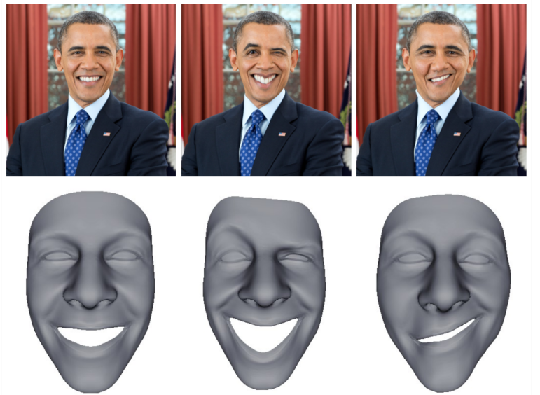

# Face Fitting
This is a face fitting tool and two applications of this. This project partially implemented several papers(see references). The provided code should be a good start if you want to implement these papers yourself.

## Coordinate Descent
We use coordinate descent to fit a face.

## Application 1: Expression flow

## Application 2: Easy Face Editing

## References
This project partially implemented the following papers:  
[1] As-rigid-as-possible shape manipulation  
[2] Poisson image editing  
[3] Laplacian surface editing  
[4] Expression flow for 3d-aware face component transfer